# 미션 가상환경 리눅스 설치
## 1. VirtualBox 설치
버전에 맞는 VirtualBox 설치
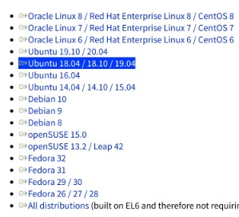

## 2. Ubuntu 18.04 이미지 파일 설치
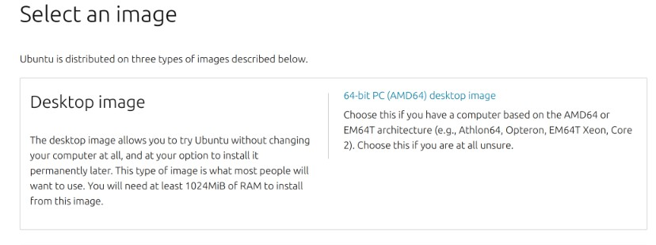

## 3. VirtualBox에 가상 머신 만들기
[우분투 가상머신 ssh 접속(Ubuntu ssh virtualbox) by 웹 개발자 콩콩시](https://lts0606.tistory.com/222) 를 참고하여 수행하였습니다.  

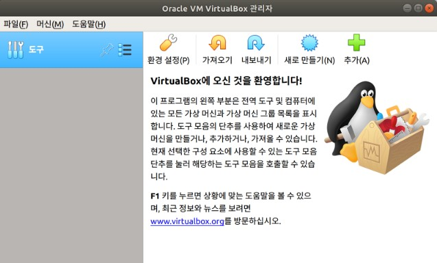
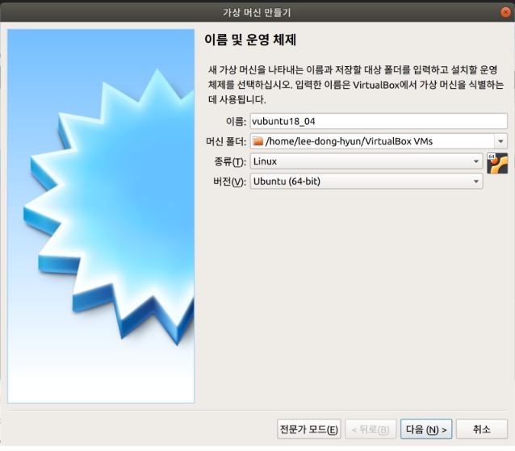
기본값으로 설치하였습니다.

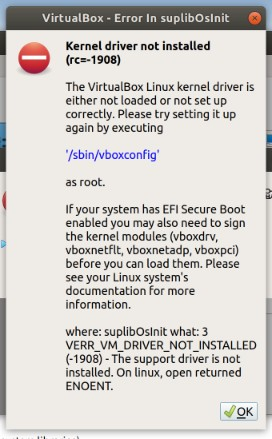  
Secure Boot Mode를 비활성 하지 않을 시 오류가 발생함  
[Asus - Bios에서 Secure boot 설정](https://www.asus.com/kr/support/FAQ/1042711/)

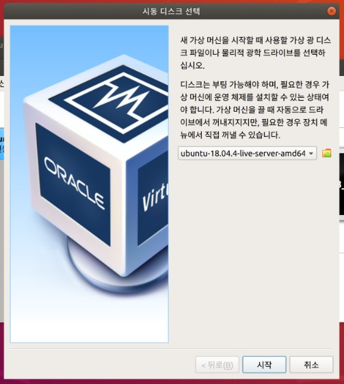
미리 설치했던 우분투 이미지 파일로 설정

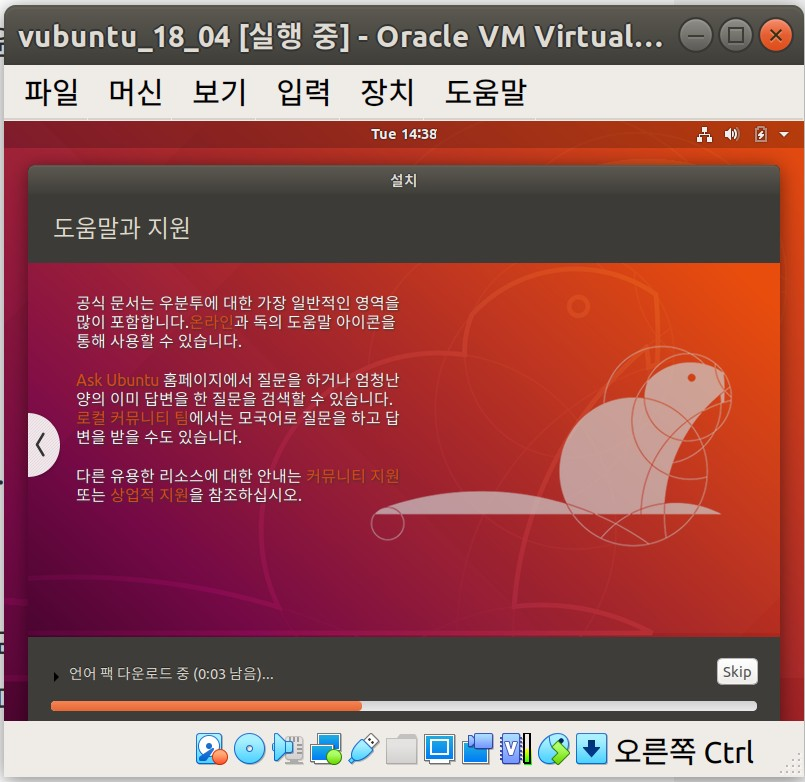
우분투 설치

## 4. VirtualBox의 가상머신에 SSH 환경 구축
1. ssh 서버가 설치 되어 있는지 확인

```
dpkg -l | grep ssh
```
2. SSH server 설치 
```
apt-get update 
apt-get install openssh-server 
```

3. SSH 서버 실행 및 동작 확인
```
service ssh start
service ssh status
```
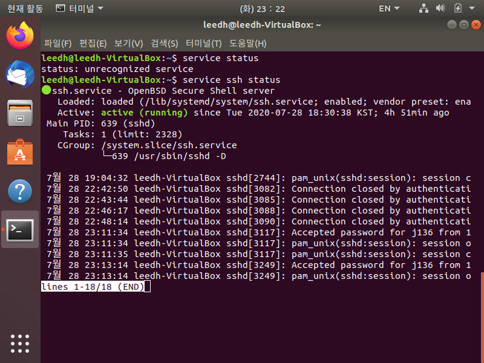

4. 방화벽 설정 변경
```
ufw enable # 방화벽 활성
ufw allow 22 # 22번 포트 허용
ufw reload # 변경사항 적용
```

5. 가상머신과 나의 컴퓨터의 터미널에서 IP 확인
```
ifconfig
```
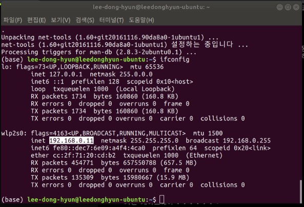
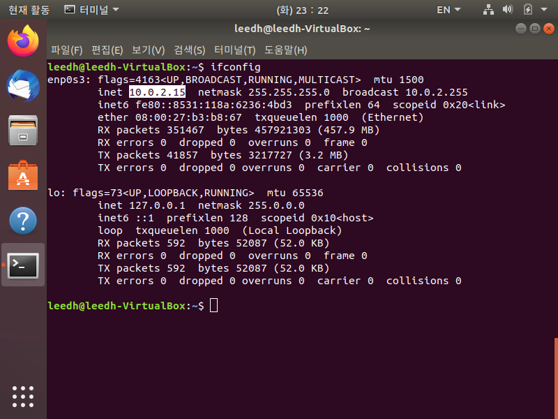

5. VirtualBox 가상 머신 > 설정 > 네트워크 > 고급 > 포트포워딩 추가  
위에서 확인한 IP주소를 입력  
* 호스트 포트를 기본값 22로 할 경우 PC의 포트와 동시에 사용하여 문제가 발생하는 것으로 생각됨
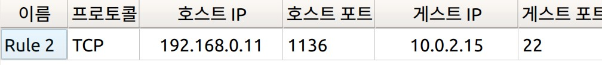

6. PC에서 SSH를 이용한 접속
```
ssh [옵션 (-p)] [포트 번호] [사용자 ID]@[서버 IP]
```
-p : 포트 번호 지정   
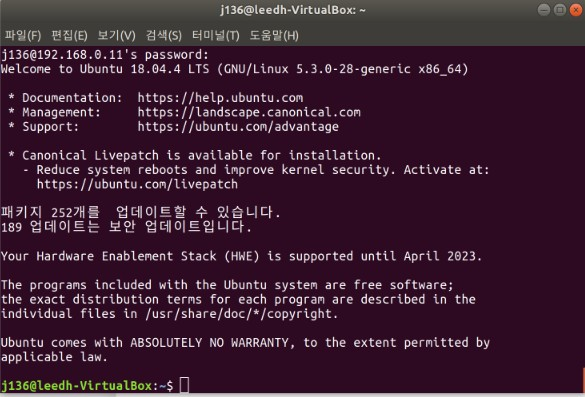

## 5. 가상 환경에서 유저가 사용할 디렉토리 설정하기
1. 디렉토리 만들기
* 디렉토리를 만들 root 권한이 필요하여 root계정으로 전환 후 만들어야 함

```
su
# 암호 입력
mkdir {디렉토리 이름}
```

2. 파일 접근 권한 설정  
[참고자료1](https://pliss.tistory.com/95)  
[참고자료2](https://ko.wikipedia.org/wiki/Chmod)
```
chmod [옵션] 모드[,모드] 파일1 [파일2 ...]
```


3. 파일 소유권 변경
```
chown [-R] [유저]][:그룹] 대상1 [대상2 ..]
```


#### 결과

